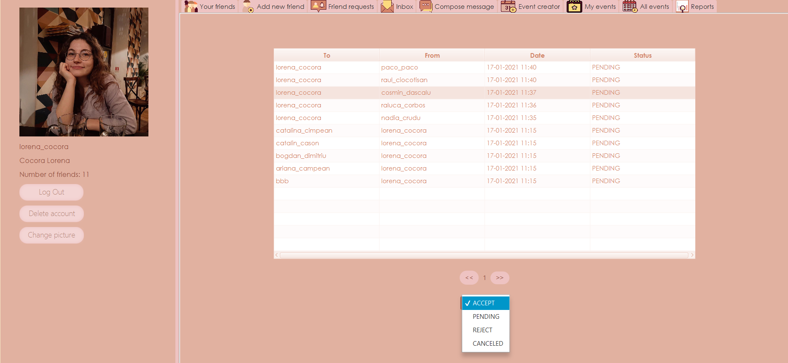
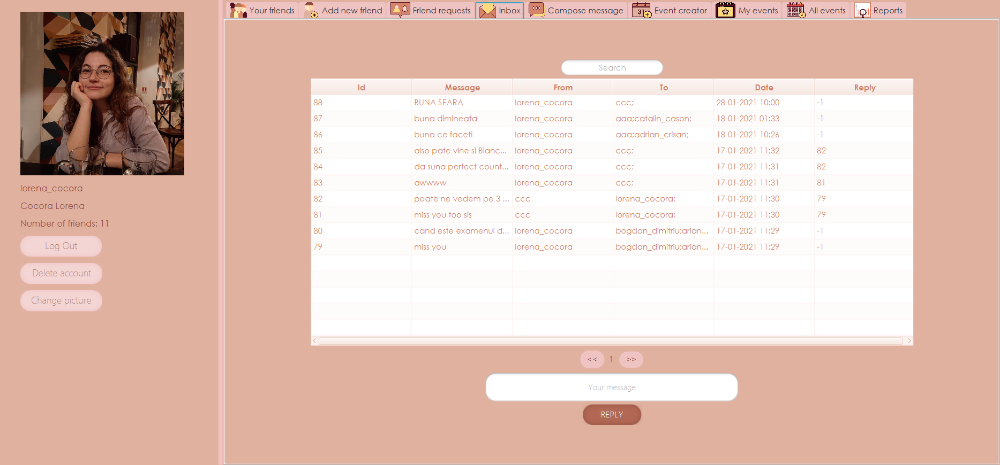
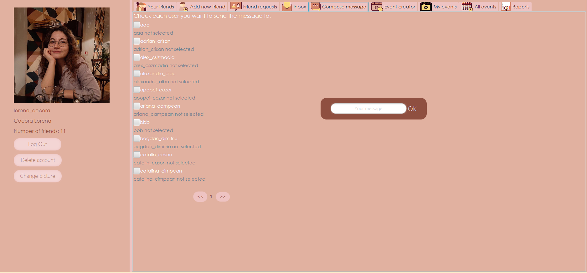
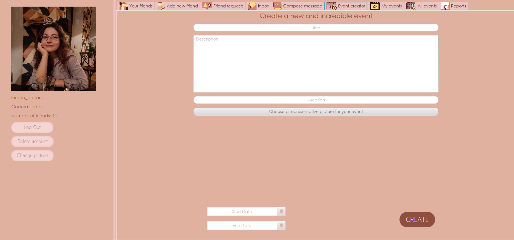
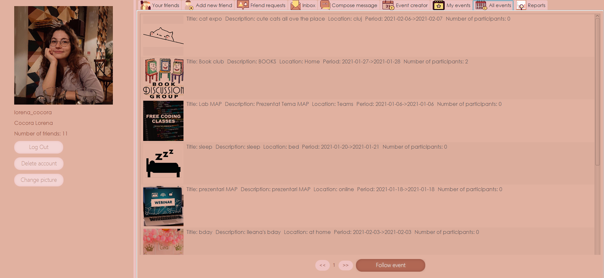
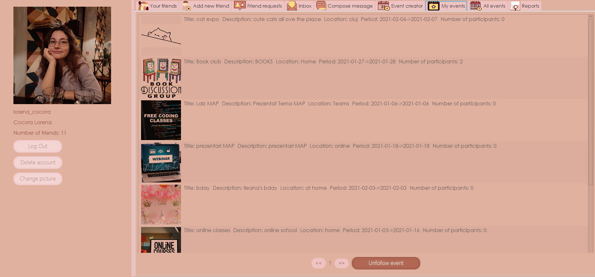
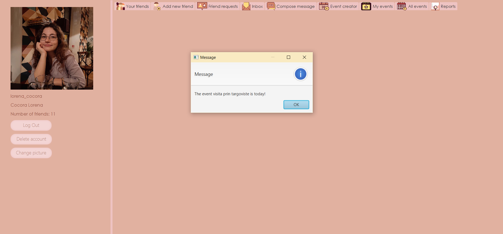
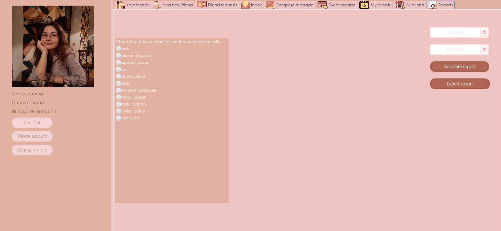
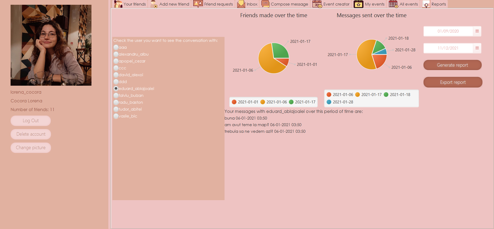
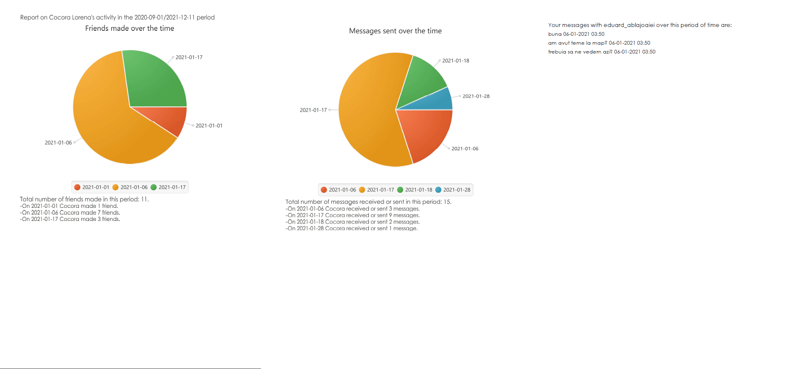

<h1>join</h1>
<h2>An app that brings you closer to your friends</h2>

<h3>What is <i>join</i> and how was it made?</h3>
<b>join</b> is a desktop application that can help you connect with your close ones:
from making new friends, to sending messages or creating events. It is a JavaFX app with a
friendly GUI, that uses a PostgreSQL local data base. This app tries to
emulate a social media/networking app via an engaging user experience and
a lot of functionalities.

When you are running the app the first window asks the user to select
if they already have an acount or if they want to sign up to our community.

If a person does not have an account they can easily register by filling in
a short list of fields with personal information.

<h3>What can you do as a user?</h3>
A reader can that is logged into the application can see in the left side of the 
screen their username, their full name and their number of friends. The user
has the possibility to change their profile picture or delete their account.
Moreover they can see a list with their current friends.

If someone wants a new friend they can send them a friend request. 

An user can reject or accept a request and, in case they change their mind they can cancel 
a request they sent. 

The inbox ilustrates the messages a user received and they can 
reply to any message. If an user wants to send a message to multiple people
at a time they can use the Compose message tab. 

The users have the possibility to creat events or follow already existing ones from the
All events tab.
When clicking on the My events tab the user receives an alert that notifies them
if they have an upcoming event in the next 24h.

For checking their activity during a period of time, users can generate reports
that contain how many new friendships they made and how many messages they exchanged in total. They can also see 
how many messages they exchanged with a friend and which are those messages. If they want, they can export the report as a PDF.

