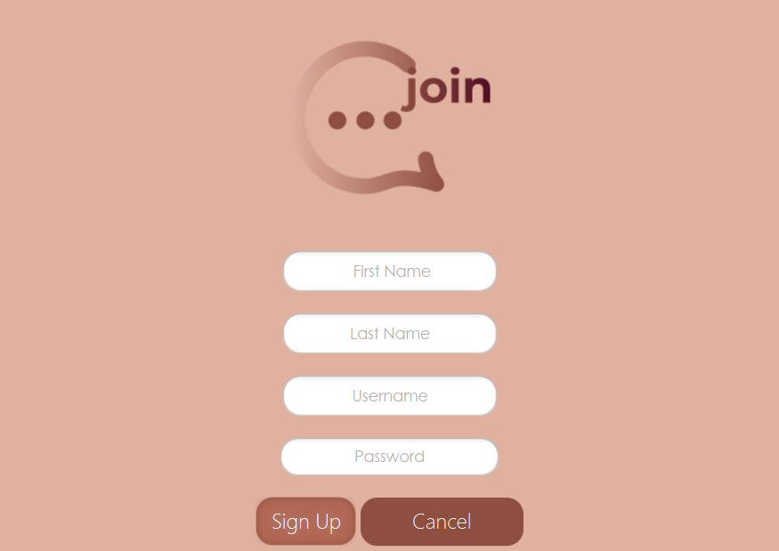
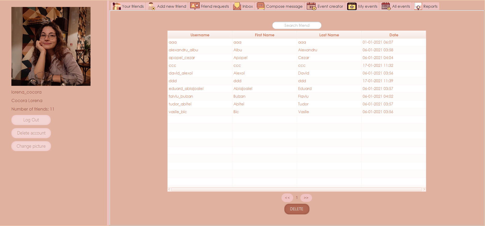
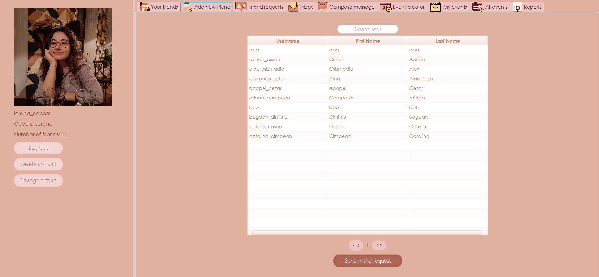
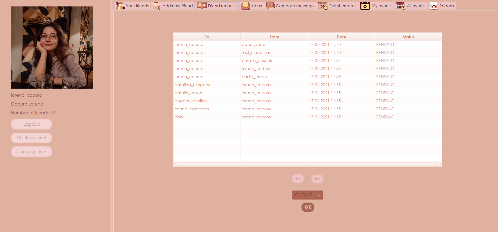

<h1>join</h1>
<h2>An app that brings you closer to your friends</h2>

<h3>What is <i>bibliophile</i> and how was it made?</h3>
<b>bibliophile</b> is a desktop application that can help any library in their
pursue of managing their day to day activities: from lending books
to keeping an inventory of all their volumes. It is a JavaFX app with a
friendly GUI, that uses a SQLite local data base. As a client/server application
it is based on the RPC protocol.
When you are running the app the first window asks the user to select
if they are a reader or a librarian.

<h3>What can you do as a reader?</h3>
A reader can log into the application, discover and borrow books, search
for a specific volume and check the books they already borrowed. At the end
they can log out.

<h3>What can you do as a librarian?</h3>
As a librarian, you can log into the application, see all the loans you are managing and
making returns.

