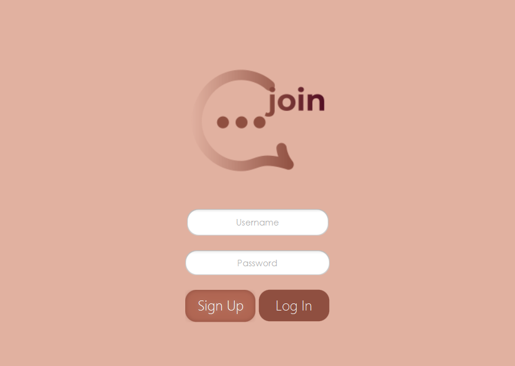

<h1>join</h1>
<h2>An app that brings you closer to your friends</h2>

<h3>What is <i>join</i> and how was it made?</h3>
<b>join</b> is a desktop application that can help you connect with your close ones:
from making new friends, to sending messages or creating events. It is a JavaFX app with a
friendly GUI, that uses a PostgreSQL local data base. This app tries to
emulate a social media/networking app via an engaging user experience and
a lot of functionalities.

When you are running the app the first window asks the user to select
if they are a reader or a librarian.

<h3>What can you do as a user?</h3>
A reader can log into the application, discover and borrow books, search
for a specific volume and check the books they already borrowed. At the end
they can log out.

